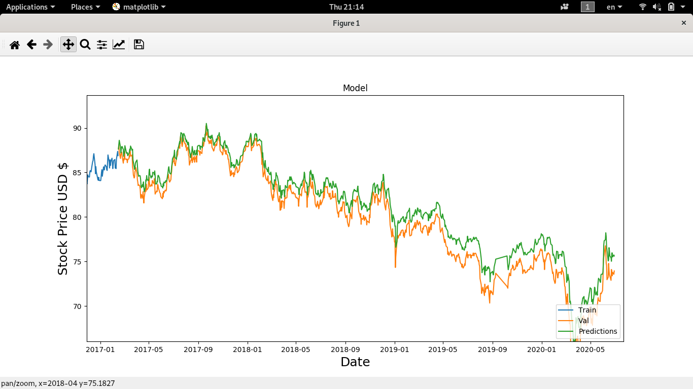

# Stock-Predict-with-Deep-Learning

aplikasi untuk memprediksi stock price berdasarkan harga close 100 hari terakhir

# Tingkat keakurasian program



**garis hijau melambahkan harga predict dari program**
**garis orange harga real dari stock price**

Prediksi diatas didapat setelah training menggunakan stock price dari tahun 2004

# penjelasan fungsi setiap script
**1. getDataframe.py**
  
  digunakan untuk mendapatkan data stock price sesuai mata uang atau saham yang diinginkan
  
  cara mengganti mata uang atau saham
  ```bash
  line 14 file getDataframe.py
   df = web.DataReader("AUDJPY=X", data_source="yahoo", start="2000-01-01", end="2020-06-30")
  ```
  
  AUDJPY=X melambangkan simbol dari mata uang, untuk mendapatkan simbol lain silahkan cek yahoo financial
  
  untuk menyimpan data stock price yang sudah didapat
  ```bash
  line 15 file getDataframe.py
  with open("dataframe/dataframeAUDJPY=X.pickel", mode="wb") as file:
    pickle.dump(df, file)
  ```
  
**2. training.py**
  digunakan untuk training deep learning
  
  memanggil data stock price yang sudah tersimpan
  ```bash
  line 14 file training.py
  with open("dataframe/dataframeAUDJPY=X.pickel", mode="rb") as file:
    df = pickle.load(file)
  ```
  
  menyimpan model dari deep learning
  ```bash
  line 55 file main.py
  model.save("model/AUDJPY.keras", include_optimizer=False)
  ```
  
 **3. main.py**
  digunakan untuk mengecek tingkat keakurasian dari model deep learning
  
  memangil model yang sudah tersimpan
  ```bash
  line 11 file main.py
  model = load_model("model/AUDJPY.keras")
  ```
  
  memanggil data stock price
   ```bash
  line 14 file training.py
  with open("dataframe/dataframeAUDJPY=X.pickel", mode="rb") as file:
    df = pickle.load(file)
  ```
